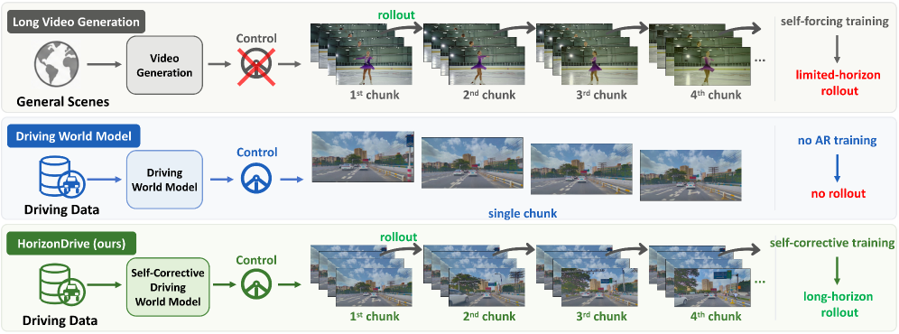

# HorizonDrive: Self-Corrective Autoregressive World Model for Long-horizon Driving Simulation

**[Conglang Zhang](https://github.com/zcliangyue)<sup>1,\*</sup>, [Yifan Zhan](https://github.com/Yifever20002)<sup>2,\*</sup>,** Qingjie Wang<sup>3</sup>, Zhanpeng Ouyang<sup>3</sup>, Yu Li<sup>4</sup>, Zihao Yang<sup>5</sup>, Xiaoyang Guo<sup>6</sup>, Weiqiang Ren<sup>3</sup>, Qian Zhang<sup>3</sup>, Zhen Dong<sup>1</sup>, Yinqiang Zheng<sup>2</sup>, Wei Yin<sup>3,‡</sup>, Zhengqing Chen<sup>3,†</sup>

<sup>1</sup> [Wuhan University](https://www.whu.edu.cn/) &nbsp; <sup>2</sup> [The University of Tokyo](https://www.u-tokyo.ac.jp/en/) &nbsp; <sup>3</sup> [Horizon Robotics](https://en.horizon.auto/) &nbsp; <sup>4</sup> [Tsinghua University](https://www.tsinghua.edu.cn/en/) &nbsp; <sup>5</sup> [University of Science and Technology of China](https://en.ustc.edu.cn/) &nbsp; <sup>6</sup> [The Chinese University of Hong Kong](https://www.cuhk.edu.hk/english/)

\* Equal contribution &nbsp; ‡ Project lead &nbsp; † Corresponding author

<div align="center">
  &nbsp;&nbsp;&nbsp;&nbsp;
  
</div>

<br>

<div align="center">

[](https://arxiv.org/abs/2605.11596)
[](https://zcliangyue.github.io/HorizonDrive/)
[](https://github.com/zcliangyue/HorizonDrive)

</div>

<!-- Project page: https://zcliangyue.github.io/HorizonDrive/ -->

## 📌 TODO

- [x] Inference code
- [ ] Model Checkpoints

## 🌍 Overview

**HorizonDrive is an anti-drifting training-and-distillation framework for minute-scale autoregressive driving simulation.** Through self-corrective teacher training and teacher rollout long-horizon distillation, HorizonDrive enables minute-scale, action-controllable autoregressive video generation of complex driving scenarios on a single GPU, and supports closed-loop interactive simulation.

<div align="center">
  
</div>

## ✨ Key Features

* Controllable driving scene generation.
* Stable minute-scale autoregressive rollout.
* Interactive AR rollout for closed-loop driving simulation.
* Generalizable across diverse driving scenes and scenarios.
* No reliance on explicit 3D representations.

## 🧪 Abstract

Closed-loop driving simulation requires real-time interaction beyond short offline clips, pushing current driving world models toward autoregressive (AR) rollout. Existing AR distillation approaches typically rely on frame sinks or student-side degradation training. The former transfers poorly to driving due to fast ego-motion and rapid scene changes, while the latter remains bounded by the teacher’s single-pass output length and thus provides only a limited supervision horizon. A natural question is: can the teacher itself be extended via AR rollout to provide unbounded-horizon supervision at bounded memory cost? The key difficulty is that a standard teacher drifts under its own predictions, contaminating the supervision it provides. **Our key insight is to make the teacher rollout-capable, ensuring reliable supervision from its own AR rollouts.** This is instantiated as HorizonDrive, an anti-drifting training-and-distillation framework for AR driving simulation. First, scheduled rollout recovery (SRR) trains the base model to reconstruct ground-truth future clips from prediction-corrupted histories, yielding a teacher that remains stable across long AR rollouts. Second, the rollout-capable teacher is extended via AR rollout, providing long-horizon distribution-matching supervision under bounded memory, while a short-window student aligns to it with teacher rollout DMD (TRD) for efficient real-time deployment. HorizonDrive natively supports minute-scale AR rollout under bounded memory; on nuScenes, HorizonDrive reduces FID by 52% and FVD by 37%, and lowers ARE and DTW by 21% and 9% relative to the strongest long-horizon streaming baselines, while remaining competitive with single-pass driving video generators.


## ⚙️ Quick Start

### 1. Clone The Repository

```bash
git clone https://github.com/zcliangyue/HorizonDrive.git
cd HorizonDrive
```

If you are using an internal or forked repository, clone that repository instead;
the commands below assume that the current working directory is the repository root.

### 2. Create The Python Environment

The evaluation environment is aligned with Python 3.10, CUDA 12.8, and PyTorch
2.8.0. A Docker image with this stack is recommended. Inside the environment,
install the project dependencies with:

```bash
python3 -m pip install -r requirements.txt
```

If your network cannot access the public PyTorch wheel index, install the matching
PyTorch/CUDA wheels from your local mirror first, then install the remaining
packages from `requirements.txt`.

### 3. Prepare Model Files

Place the model files under the top-level `models/` directory. The default
evaluation scripts expect the following layout:

```text
models/
├── Wan2.1-T2V-1.3B/
│   ├── config.json
│   ├── diffusion_pytorch_model.safetensors
│   ├── models_t5_umt5-xxl-enc-bf16.pth
│   └── google/
│       └── umt5-xxl/
│           ├── special_tokens_map.json
│           ├── spiece.model
│           ├── tokenizer.json
│           └── tokenizer_config.json
├── horizondrive-dit.safetensors
├── horizondrive-vae.pkl
├── fvd/
│   └── styleganv/
│       └── i3d_torchscript.pt
└── fid/
    └── weights-inception-2015-12-05-6726825d.pth
```

Model weights will be released at https://huggingface.co/zcliangyue/HorizonDrive.

### 4. Prepare nuScenes Data

The default config reads nuScenes images and metadata from:

```yaml
samples_path: "./nuScenes/origin"
ann_path: "./nuScenes-metadata-full/nuscenes_mmdet3d-12Hz/nuscenes_interp_12Hz_infos_val_with_bid.pkl"
```

### 5. Run Evaluation

Run the default evaluation:

```bash
bash run_eval.sh
```

For multi-process evaluation:

```bash
CUDA_VISIBLE_DEVICES=0,1,2,3 NUM_PROCESSES=4 bash run_eval.sh
```

Useful output locations:

```text
logs/test/validation_res_final/i2v_cond_unroll_211f/
├── <clip_id>.mp4
├── <clip_id>_comparison.mp4
├── <clip_id>_gt.mp4
├── <clip_id>_hdmap.mp4
├── <clip_id>_bbox.mp4
├── fid_scores.txt
└── fvd_scores.txt
```

> Note: A noticeable portion of nuScenes samples contain inaccurate control annotations, which are often visible in `<clip_id>_hdmap.mp4`; these noisy annotations can affect both training quality and inference results.


## 📚 Citation

If you find our work useful, please cite it as

```bibtex
@misc{zhang2026horizondriveselfcorrectiveautoregressiveworld,
      title={HorizonDrive: Self-Corrective Autoregressive World Model for Long-horizon Driving Simulation}, 
      author={Conglang Zhang and Yifan Zhan and Qingjie Wang and Zhanpeng Ouyang and Yu Li and Zihao Yang and Xiaoyang Guo and Weiqiang Ren and Qian Zhang and Zhen Dong and Yinqiang Zheng and Wei Yin and Zhengqing Chen},
      year={2026},
      eprint={2605.11596},
      archivePrefix={arXiv},
      primaryClass={cs.CV},
      url={https://arxiv.org/abs/2605.11596}, 
}
```

## 🤝 Acknowledgments

We gratefully acknowledge [**Self-Forcing**](https://github.com/guandeh17/Self-Forcing) and [**LongLive**](https://github.com/NVlabs/LongLive) for their inspiring methods and open-source code; [**CompoSIA**](https://github.com/Yifever20002/CompoSIA), [**VideoX-Fun**](https://github.com/aigc-apps/VideoX-Fun) and [**Wan2.1**](https://github.com/Wan-Video/Wan2.1/) for their codebases and base video generation models; and [**nuScenes**](https://www.nuscenes.org/) for the autonomous driving dataset.
